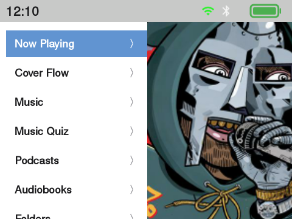
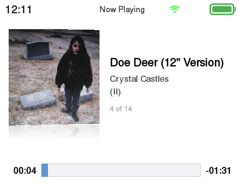
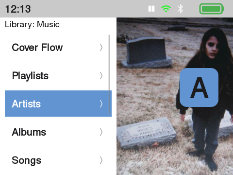
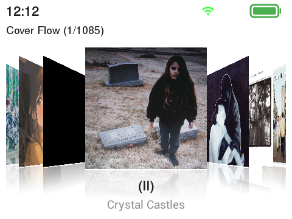
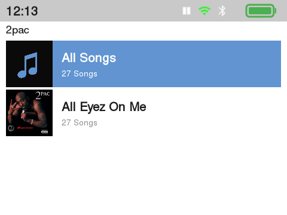
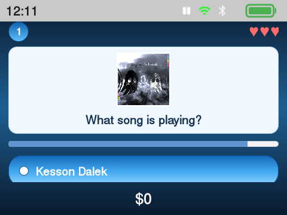

# JJ Launcher Classic Version

<p align="center">
  
  
  
  
</p>

A fork of [ismileblue/y1_launcher](https://github.com/ismileblue/y1_launcher) (JJ Launcher / MO-ON Launcher) for the **Innioasis Y1**. The goal of this fork is to turn JJ Launcher into as close to the original **iPod Classic experience** as possible — a bundled iPod-style theme, Last.fm scrobbling, a Music Quiz mini-game, and broader format support — while keeping everything JJ Launcher already does well.

This is **not** a GitHub "Fork" in the technical sense (it's a separate repository), but it is built directly on top of JJ Launcher's source and stays close to upstream so future JJ Launcher releases can keep being merged in.

> [!WARNING]
> Currently only tested and available for the **Innioasis Y1**. It has only been verified on device System Software version 2.1.9 — check your own firmware version before installing anything below.

---

## Screenshots

| Main Menu | Now Playing | Music |
|---|---|---|
|  |  |  |

| Cover Flow | Album View | Music Quiz |
|---|---|---|
|  |  |  |

---

## What's different from upstream JJ Launcher

Everything below was added/changed on top of JJ Launcher; anything not listed here (media scanner, EQ, Bluetooth pairing, Wi-Fi keyboard, web server upload, custom theme engine, etc.) still works exactly as in the original project — see [ismileblue/y1_launcher](https://github.com/ismileblue/y1_launcher) for that documentation.

- **Built-in "iPod Classic" theme** — a bundled, ready-to-use theme aiming for a 1:1 iPod Classic look:
  - White, plain-text iPod-style menu lists (no icons, tight left margin, consistent bold system font)
  - Two-pane Main Menu and Music menu: menu list on the left, a slowly panning album cover on the right that fills the screen and extends up behind the status bar
  - Redesigned Now Playing screen: angled album cover with a reflection underneath, centered track info, thick square progress bar
  - Redesigned album lists: large cover art, bold album name + song count subtitle, and an "All Songs" shortcut per artist
  - A real search screen (title/artist/album) reachable from the Music menu
- **Last.fm scrobbling** — two independent mechanisms, like Rockbox:
  - A permanent local `.scrobbler.log` in the classic Audioscrobbler 1.1 format
  - Live scrobbling against the real Last.fm API (`auth.getMobileSession` / `track.updateNowPlaying` / `track.scrobble`), with a browser-based login flow (via the device's Wi-Fi web server) since typing a username/password with a click-wheel is painful
- **Music Quiz (first version)** — a from-scratch recreation of the classic iPod Music Quiz game using your own library: 10-second clips, 5-answer rounds, lives, and a score, styled in the original's 2000s "Fruitiger Aero" glossy look
- **OGG Vorbis support** — playback and library scanning for `.ogg` files, including automatic detection of files that are actually Opus-encoded but saved with an `.ogg` extension (common with some ripping tools)
- Assorted library/UI fixes made along the way: duplicate song de-duplication, folder-cover-art fallback for albums without embedded art, album-artist grouping, forced 1:1 album art cropping, and OOM hardening for the device's limited RAM during large library scans

## Installation

1. Install **JJ Launcher** on your Innioasis Y1 via the [Innioasis Updater](https://www.innioasis.com/pages/download), if you haven't already. This fork replaces the JJ Launcher app itself — it does not replace the device firmware.
2. **Uninstall the stock JJ Launcher app** — this step is required, not optional (see [why](#replacing-the-stock-jj-launcher-app) below):
   ```bash
   adb uninstall com.themoon.y1
   ```
   If that fails because JJ Launcher was baked into your firmware image as a system app, use this instead:
   ```bash
   adb shell pm uninstall --user 0 com.themoon.y1
   ```
3. Connect the device to your PC and download the latest APK from this repo's [Releases](../../releases) page.
4. Install the fork:
   ```bash
   adb install JJLauncherClassic-<version>.apk
   ```
5. (Optional, only if Bluetooth pairing ever asks for a permission you can't grant from the UI):
   ```bash
   adb shell pm grant com.themoon.y1 android.permission.WRITE_SECURE_SETTINGS
   ```

To enable Last.fm scrobbling, open **Settings → Last.fm** on the device and log in through the browser-based flow (the device shows a URL/QR you open on your phone or PC). To use a custom theme other than the bundled iPod Classic one, see JJ Launcher's original theme documentation.

### Replacing the stock JJ Launcher app

Both this fork and the stock JJ Launcher use the same package name (`com.themoon.y1`), but this fork's release APKs are currently **debug-signed** (see [Building it yourself](#building-it-yourself) — there's no shared release keystore yet). Android refuses to install an APK over an existing app if the signing certificate doesn't match, so skipping step 2 above and just running `adb install -r` will fail with:

```
Failure [INSTALL_FAILED_UPDATE_INCOMPATIBLE: ... signatures do not match]
```
or on older Android versions:
```
INSTALL_PARSE_FAILED_INCONSISTENT_CERTIFICATES
```

That's why step 2 above always comes before installing this fork — there's no way around uninstalling first as long as this fork ships debug-signed builds.

**What you keep, what you lose:** uninstalling only clears the app's private settings (app-internal preferences like toggles and any saved Last.fm session — you'll need to log in again). Your **music library**, **themes** (`/storage/sdcard0/Y1_Themes`), and the **`.scrobbler.log`** all live on the SD card, outside the app's private storage, so they're untouched and picked up again automatically on first launch.

## Building it yourself

Last.fm requires every client to use its own API credentials, so none are shipped in this repository. To build from source:

1. Register a free API account at [last.fm/api/account/create](https://www.last.fm/api/account/create).
2. Add these two lines to your own `local.properties` (already gitignored, never committed):
   ```properties
   lastfm.api.key=YOUR_KEY
   lastfm.api.secret=YOUR_SECRET
   ```
3. Build as usual (`./gradlew assembleDebug`). Without a key, the app still runs fine — scrobbling simply won't authenticate.

## Credits & License

- Based on [ismileblue/y1_launcher](https://github.com/ismileblue/y1_launcher) (JJ Launcher / MO-ON Launcher) — all credit for the original launcher, media engine, and theme system goes to the original author.
- The bundled iPod Classic theme's system font is [Nimbus Sans](https://en.wikipedia.org/wiki/Nimbus_Sans) (URW++), a free, metric-compatible alternative to Helvetica.
- Distributed under the same license as upstream — see [LICENSE](LICENSE) (free for personal/educational, non-commercial use).

See [CHANGELOG.md](CHANGELOG.md) for the full version history.
